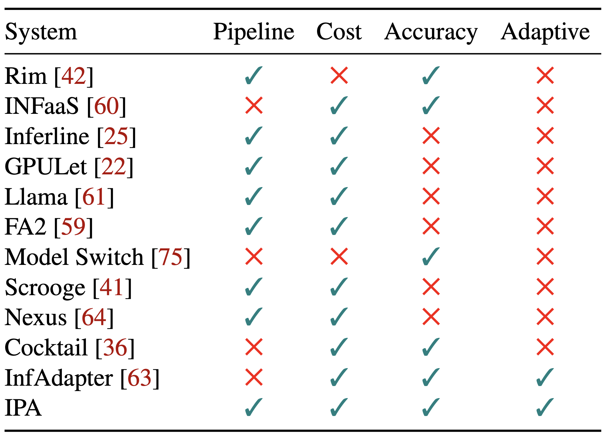
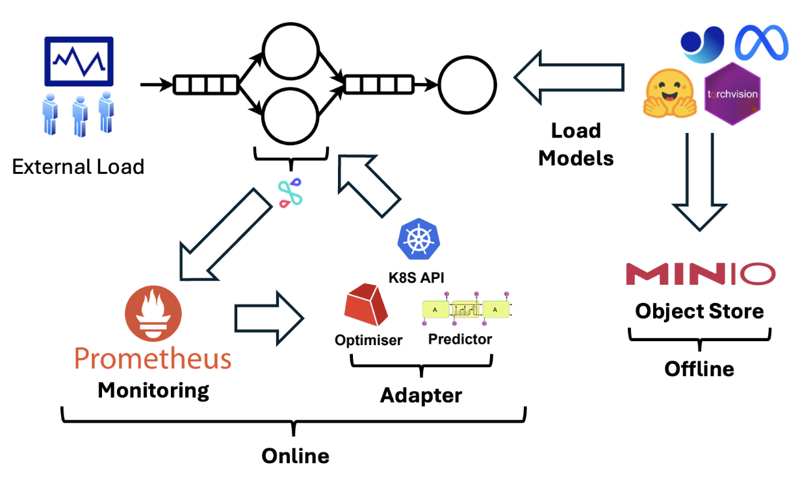

# Comments
- Start with replication of IPA [2]
- Start profiling experiments with etrace2 [1]
- Setup experiment end-to-end experiments to determine power consumption

# Project Repository
https://github.com/csce585-mlsystems/ipa-ext

# Introduction
Accounting for fast, accurate, and cost-effective inference is challenging in multi-model inference pipelines. Furthermore, pipeline adaptation systems account for the trade-off between accuracy, latency, and cost but lack in representing energy trade-offs. We want to include energy information to modify the Inference Pipeline Adapter (IPA) to consider energy tradeoffs in addition to accuracy, latency, and cost.
By integrating energy metrics, the IPA will be capable of considering performance with environmental impact. This enables it optimizing not only for operational efficiency but also for decreased energy consumption. In this way, the IPA can adapt model selection and resource allocation in response to realtime energy usage, towards sustainable AI practices.
The system can prioritize energy-efficient models without substantially sacrificing accuracy or speed, particularly in situations where energy expenses are pivotal. This being said, we plan to explore different ideas and approaches for incorporating this new metric to the existing ones, and choose the one that best suites the needs and time constraints of this project. However, we will consider a discussion on other approaches, such as reinforcement learning for further optimizing the parameter space, if not able to implement.

# Problem Statement
Modern applications like autonomous vehicles, healthcare diagnostics, and recommendation systems rely on complex machine learning (ML) inference pipelines that require high accuracy under strict latency constraints. Running these models at scale leads to significant energy consumption, resulting in higher operational costs and contributing to environmental impacts due to increased carbon emissions. The current Inference Pipeline Adapter (IPA) system does not report energy consumption across different experiments/workloads. IPA also lacks energy efficiency benchmarks compared against other inference-serving/pipeline systems. This lack of energy awareness makes it challenging to optimize for energy efficiency to meet industry standards for sustainable AI/ML deployment. By addressing this gap, IPA can be a viable solution for real-world applications that demand performance, cost-effectiveness, and sustainability.

*Feature comparison table [6]*

# Solution
- Start with etrace2 and Zeus [5], to measure energy
- We aim to maximize accuracy, minimize latency, and minimize energy consumption
- We aim to benchmark IPA on different model workloads:
  - One-shot segmentation (SAM)
  - LLM

*Mapping of code modules and IPA*

# Evaluation
- Different factors take part in energy consumption. Some of the factors are:
  - Hardware
  - Model size
  - Hyperparameters (e.g. batch size)
- Energy consumption or carbon emission can be estimated using the GPUs' Thermal Design Power (TDP)
  - TDP uses maximum power consumption [4]
  - We are interested in energy consumption changes w.r.t parameters
- We aim to benchmark the energy consumption of IPA with different configurations, using tools such as Zeus for GPU [5] and etrace2 for CPU
- Moreover, we plan to have a discussion on how this metric can be optimized

# Related Work
Our project extends prior work on optimizing machine learning (ML) inference serving systems by incorporating energy consumption into the optimization objectives. Previous systems like InferLine [8] and Loki [9] focused on latency-aware provisioning and scaling for prediction serving pipelines, optimizing for latency and cost but not considering energy efficiency. AutoInfer [10] and Swayam [11] introduced self-driving management and distributed autoscaling to ensure response-time Service Level Agreements (SLAs) while maximizing resource efficiency, yet they did not explicitly address energy consumption or environmental impact. Studies like Harty et al. [12] investigated energy consumption in ML training and inference, emphasizing energy-efficient practices, while Clover [3] presented a carbon-friendly ML inference service runtime that balances performance, accuracy, and carbon emissions. Our work builds upon these efforts by extending the Inference Pipeline Adapter (IPA) [2] to consider energy trade-offs alongside accuracy, latency, and cost, operationalizing energy-efficient practices within a system-level optimization framework.

# References
[[1] etrace2](https://chameleoncloud.readthedocs.io/en/latest/technical/metrics.html#energy-and-power-consumption-measurement-with-etrace2)

[[2] Ghafouri, S., Razavi, K., Salmani, M., Sanaee, A., Lorido-Botran, T., Wang, L., ... & Jamshidi, P. (2023). IPA: Inference Pipeline Adaptation to Achieve High Accuracy and Cost-Efficiency. arXiv preprint arXiv:2308.12871.](https://arxiv.org/abs/2308.12871)

[[3] Li, B., Samsi, S., Gadepally, V., & Tiwari, D. (2023, November). Clover: Toward sustainable ai with carbon-aware machine learning inference service. In Proceedings of the International Conference for High Performance Computing, Networking, Storage and Analysis (pp. 1-15).](https://dl.acm.org/doi/abs/10.1145/3581784.3607034)

[[4] Luccioni, Alexandra Sasha, Sylvain Viguier, and Anne-Laure Ligozat. "Estimating the carbon footprint of bloom, a 176b parameter language model." Journal of Machine Learning Research 24.253 (2023): 1-15.](https://www.jmlr.org/papers/v24/23-0069.html)

[[5] PyTorch. "Zeus: A New Framework for Distributed Training in PyTorch." PyTorch Blog](https://pytorch.org/blog/zeus/)

[[6] Salmani, M., Ghafouri, S., Sanaee, A., Razavi, K., Mühlhäuser, M., Doyle, J., ... & Sharifi, M. (2023, May). Reconciling high accuracy, cost-efficiency, and low latency of inference serving systems. In Proceedings of the 3rd Workshop on Machine Learning and Systems (pp. 78-86).](https://dl.acm.org/doi/abs/10.1145/3578356.3592578?casa_token=9nlFKXWZvv4AAAAA:ZOsE8kijtH3aVdXTV7EgwtSEYzE-PLc6CJd6UfxjbBmu6k80h8EvFX65sxlhNmI0CzpIFVD4OZIc)

[[7] Time-Slicing GPUs in Kubernetes](https://docs.nvidia.com/datacenter/cloud-native/gpu-operator/latest/gpu-sharing.html)

[[8] Crankshaw, D., Wang, G., Zhou, X., Franklin, M. J., Gonzalez, J. E., & Stoica, I. (2020). InferLine: Latency-aware provisioning and scaling for prediction serving pipelines. _Proceedings of the ACM Symposium on Cloud Computing (SoCC)_, 477–491.](https://dl.acm.org/doi/pdf/10.1145/3419111.3421285)

[[9] Du, Z., Guo, W., Wang, X., Gao, B., Wang, Z., & Zhang, Y. (2023). Loki: A system for serving ML inference pipelines with hardware and accuracy scaling. _Proceedings of the 27th ACM SIGPLAN Symposium on Principles and Practice of Parallel Programming (PPoPP)_, 427–439.](https://dl.acm.org/doi/pdf/10.1145/3625549.3658688)

[[10] He, C., Sun, L., Li, J., & Li, K. (2021). AutoInfer: Self-driving management for resource-efficient, SLO-aware machine-learning inference in GPU clusters. _IEEE Transactions on Parallel and Distributed Systems_, 32(1), 92–105.](https://ieeexplore.ieee.org/abstract/document/9956001?casa_token=Iud9yB73WhMAAAAA:Fwq1iPAIMWu3AjYIjurHwEzpizrCV8BidkETMun4bbvKQxXig_xzlA1LiuoEVkjQ9xWbp3TUatk)

[[11] Harlap, A., Narayanan, D., Phanishayee, A., Seshadri, V., & Ganger, G. R. (2017). Swayam: Distributed autoscaling to meet SLAs of machine learning inference services with resource efficiency. _Proceedings of the 2017 ACM Symposium on Cloud Computing (SoCC)_, 185–197.](https://dl.acm.org/doi/pdf/10.1145/3135974.3135993)

[[12] Harty, A., Shah, N., Fleming, T., Asuni, N., & Jiang, N. (2023). Computing within limits: An empirical study of energy consumption in ML training and inference. _arXiv preprint arXiv:2303.12101_.](https://arxiv.org/pdf/2406.14328)
